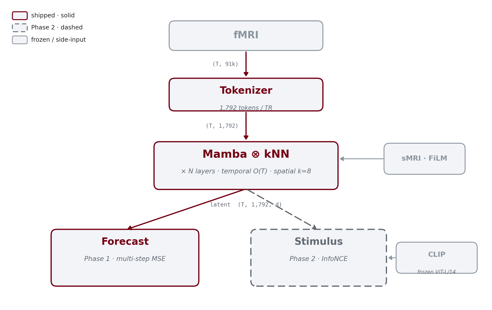
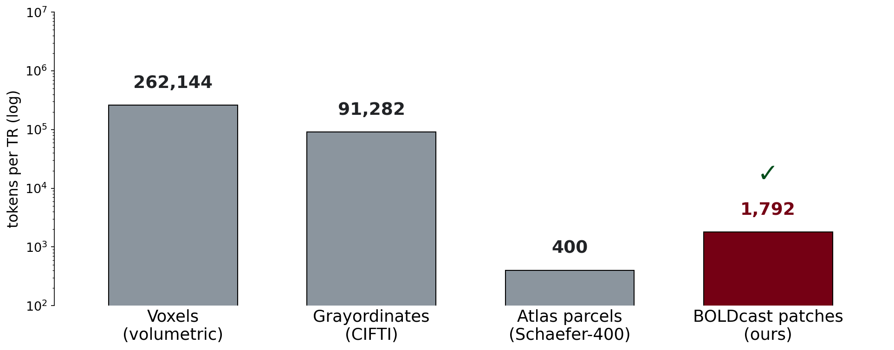
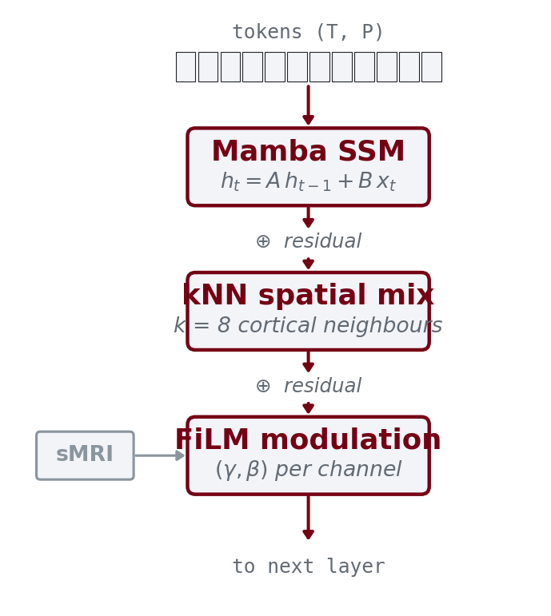
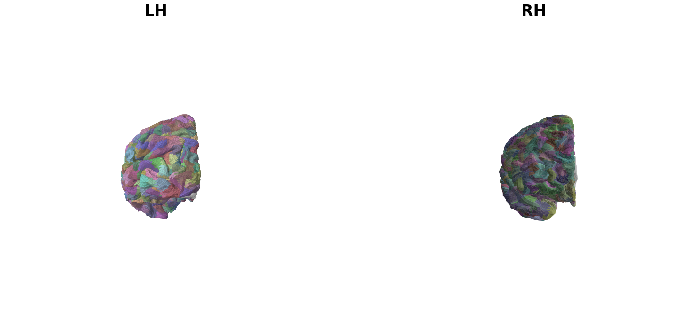
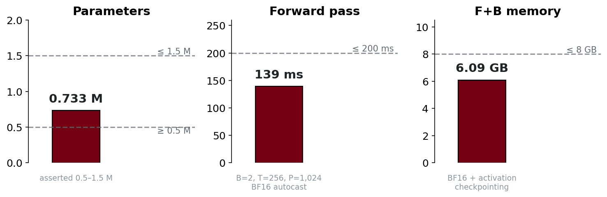

<!--
BOLDcast seed-grant pitch deck.

Source of truth for numbers (audit before each rehearsal):
- docs/proposal.md           (Table 1: memory + batch sizes, success criteria, timeline)
- docs/methods.md            (architecture spec, training objectives, eval protocols)
- docs/10_day_plan.md        (per-day acceptance criteria, demo caveats)
- Day-3 PR #3 / orcd_benchmarks.md (0.733M, 139 ms, 6.09 GB on H200)
- Day-1 PR #1                (6.2e-11 round-trip, 34 tests, subject 115825)

Render:
  npx -y @marp-team/marp-cli@latest talk/seed_pitch.md -o talk/seed_pitch.html --html --allow-local-files
  npx -y @marp-team/marp-cli@latest talk/seed_pitch.md --pdf --html --allow-local-files -o talk/seed_pitch.pdf
-->

<!-- ====================================================================
     SPEAKER PREP CHEAT SHEET — read once before the talk
     ====================================================================

     AUDIENCE: ORCD reviewers. Mix of HPC engineers, research-computing
     decision-makers, and ML-fluent faculty who allocate compute. Treat
     them as:
       • Comfortable with deep learning, scaling laws, DDP, mixed
         precision. No need to motivate "why deep learning."
       • Unfamiliar with fMRI specifics. Define TR, voxel, grayordinate,
         CIFTI on first use in any answer.
       • Care a lot about compute economics. GPU-memory math, multi-GPU
         scaling, B200 vs H200 — they want concrete numbers.

     TALK GOAL: demonstrate readiness. "We've shipped the infrastructure;
     the seed grant turns it into the science." Lead with what's running
     on H200, defend the architectural choices with measured numbers.

     ====================================================================
     QUICK TERM REFERENCE — in case you blank under pressure
     ====================================================================

     • fMRI: functional MRI. Measures the BOLD signal (blood oxygenation)
       every 1–2 s as a delayed proxy for neural activity. Neural firing
       peaks → BOLD peaks ~5–6 s later.

     • TR (repetition time): how often the scanner samples a brain
       volume. HCP 3T REST: 0.72 s. HCP 7T: 1.0 s (rest) or 0.7 s (movie).
       CNeuroMod: 1.49 s. So "T=256 TRs at 1.0 s" ≈ 4.3 minutes.

     • Voxel: a 3D pixel of brain. ~64³ ≈ 262k voxels per timepoint at
       2 mm resolution. ~90 % is non-brain (skull, CSF, air).

     • CIFTI: a file format that represents brain data as ~91k
       grayordinates instead of voxels. ~62k on the cortical surface
       (32492 verts × 2 hemispheres, medial wall removed) + ~31k
       subcortex/cerebellum voxels. NO skull, NO air.

     • Grayordinate: a single CIFTI point. Cortex grayordinates are
       vertices on the fs_LR 32k mesh; subcortex grayordinates are
       2 mm MNI voxels.

     • fs_LR 32k: the HCP-standard cortical mesh — 32492 vertices per
       hemisphere, registered to a group template. Subjects share the
       same mesh topology, so a patch defined once works for all.

     • Geodesic patch: a connected region of the cortical surface.
       Geodesic distance = shortest path along the mesh surface (NOT
       Euclidean through-the-brain distance). 1,024 patches total
       (512 per hemisphere) cover the cortex.

     • FPS (Farthest-Point Sampling): iteratively pick the next seed
       to be the vertex maximally far from all previous seeds. Greedy
       but deterministic given a starting seed.

     • Lloyd relaxation: after FPS, re-center each patch at its
       geodesic centroid, re-assign, repeat until convergence. Tightens
       patch shapes; reduces size variance.

     • Mamba / SSM (State-Space Model): a sequence model based on a
       linear recurrence in continuous state, discretized + selective.
       Compute and memory scale O(T) instead of attention's O(T²).
       Custom CUDA kernels (selective_scan) make it fast on Hopper.

     • Selective scan: Mamba's core operation — a hardware-aware
       parallel scan over time with input-dependent state transitions.
       Roughly: y_t = C · h_t, h_t = A(x_t)·h_{t-1} + B(x_t)·x_t.

     • kNN attention: attention restricted to k nearest neighbours on
       a graph instead of all pairs. We use k = 8 on the cortical
       adjacency graph. Compute O(k·P) instead of O(P²).

     • FiLM (Feature-wise Linear Modulation): inject side information
       (here, per-subject structural MRI: cortical thickness, surface
       area, sulcal depth, myelin) as per-channel (γ, β) scale-and-shift
       on the hidden state.

     • HRF (Hemodynamic Response Function): kernel that converts neural
       activity to BOLD signal. Canonical SPM HRF is a fixed double-
       gamma. We add a *learned residual FIR* on top to capture
       subject- and region-specific deviations.

     • CLIP: OpenAI's vision-language model. We use the frozen
       ViT-L/14 image encoder to embed movie frames as 768-d vectors.

     • InfoNCE: a contrastive loss. Pulls matching (brain window,
       stimulus window) pairs together in latent space; pushes
       non-matching pairs apart. Standard for multimodal alignment.

     • DDP (Distributed Data Parallel): PyTorch's standard multi-GPU
       training mode. Each GPU holds a full model replica + a shard
       of the batch; gradients are all-reduced after backward.

     • BF16: brain-float-16, half-precision with FP32's exponent range
       but 7-bit mantissa. Halves memory, ~2× throughput on H200; the
       standard for modern training.

     • Activation checkpointing: don't store all intermediate
       activations during forward pass; recompute them in backward.
       ~33 % extra compute, ~4–5× memory savings.

     ====================================================================
     IF YOU BLANK ON STRUCTURE — 12-beat outline
     ====================================================================

       1  Hook  ............... forecast brain mid-movie  (slide 2)
       2  Brain-model gap  .... 7 SOTA, none surface-based  (3)
       3  Stimulus gap  ....... 3 schools, none bidirectional  (4)
       4  Anchor  ............. full system one diagram  (5)
       5  Tokenize  ........... compression wall + 1,792 patches  (6, 7)
       6  Why Mamba  .......... linear vs quadratic, 6.09 GB measured (8)
       7  Architecture  ....... Mamba + kNN + FiLM, 3 configs  (9)
       8  Shipped  ............ Days 1–3 on real H200  (10, 11, 12)
       9  Phase 1 funded  ..... brain-only foundation, fingerprinting (13)
      10  Phase 2 funded  ..... stimulus + brain, honest bracket  (14)
      11  Release plan  ....... JOSS + nobrainer + NeurIPS/ICLR  (15)
      12  Ask  ................ 6-month compute envelope  (16)

     ====================================================================
     PRE-EMPTED OBJECTIONS — memorise these 60-second answers
     ====================================================================

     Q1. "Why Mamba — why not FlashAttention-2 at this scale?"
       A. FlashAttention reduces *peak memory* via tiling; it does NOT
          change the O(T²) compute asymptote. At T=256, P=1,024
          spatial tokens (our working window), that asymptote is the
          binding constraint, not peak activation. Mamba is linear in T.
          We measured 6.09 GB F+B on a single H200 with BF16 + activation
          checkpointing — a transformer at matched parameters would
          cross the H200 practical ceiling well below T=256.
          NeuroSTORM (Nature BME 2026) converged on Mamba independently.
          → Detail in backup B-1.

     Q2. "Why 1,024 surface patches — why not just use Schaefer-400 or
         the Glasser parcellation?"
       A. Atlases are a one-way door — they average within-parcel
          geometry away, and they commit you to one specific atlas
          forever. Our tokenizer round-trips to native CIFTI at
          6.2 × 10⁻¹¹ float64 residual on a real HCP subject (subject
          115825) — i.e., the patch representation is essentially
          lossless. Atlases discard ~58 vertices' worth of geometry
          per parcel and you can't get it back. 1,024 is enough to
          preserve fine geometry (mean 58 verts/patch, std 23) while
          being tractable for the model.

     Q3. "How do you know the learned HRF isn't overfitting to noise?"
       A. We learn the *residual* on top of canonical SPM double-gamma,
          not the full HRF — residual is small-norm by initialisation,
          and the FIR span is bounded to physiologically plausible 8 s.
          Failure mode is covered: there's a fixed-FIR fallback in
          `configs/ablations/fir_fallback.yaml` with zero learnable
          HRF parameters. We've pre-committed to comparing the two.
          → Detail in backup B-3.

     Q4. "n=8 held-out subjects is too small for fingerprinting."
       A. Agreed — and the demo is infrastructure validation, not the
          headline science claim. The funded project uses ≥ 16
          family-disjoint subjects (Restricted-DUA enforced), bootstrap
          CIs, McNemar against a Schaefer-400 baseline at matched
          architecture. Pre-registered primary endpoint = top-5
          retrieval. Power analysis says n ≈ 16 detects ≥ 15 % lift at
          α=0.05, β=0.2.
          → Detail in backup B-5.

     Q5. "How do you justify 8 × H200 GPUs for 6 months?"
       A. Per Table 1 of the proposal: default 5.2 M config @ T=256,
          P=1,792, BF16 + checkpointing is 6.9 GB/seq → 18 sequences
          per H200 GPU = effective batch 144 across 8 GPUs (or 8/GPU
          without checkpointing = batch 64). Scaled 26.5 M config is
          18.7 GB/seq w/ ckpt → 6/GPU = batch 48 across 8 GPUs. The
          linear-in-T property means doubling sequence length only
          doubles memory, so the same GPU count supports T=512 with
          re-allocation. B200 (HBM3e 192 GB) extends this to 24/GPU
          for default config — that's the upgrade path if ORCD has B200.

     Q6. "Phase 2 (stimulus alignment) isn't in the demo. How do we
         know it'll work?"
       A. We're flagging that honestly on the slide — Phase 2 is
          infrastructure-ready, not result-proven. The model has a
          stimulus head + learned-residual HRF + InfoNCE objective
          wired up. CLIP image encoders running on naturalistic fMRI
          stimuli is established (MindEye, BrainCLIP, TRIBE v2). What's
          novel here is the *bidirectional* joint latent + forecasting
          on top of a real brain backbone — TRIBE v2 is one-way
          (stimulus → brain regression), MindEye/BrainCLIP are
          static-image only. If the learned-HRF residual doesn't
          converge, we fall back to fixed FIR (B-3). If cross-dataset
          harmonization fails, we report per-dataset results (B-4).

     Q7. "What's your atlas, then?"
       A. None. That's the point. We're atlas-free: 1,024 geodesic
          patches on the fs_LR 32k group template, computed once via
          farthest-point sampling + Lloyd relaxation. Reproduces
          exactly across subjects because they share the mesh topology.
          Future ablation: try with Conte69 group template instead of
          fs_LR for an apples-to-apples test.

     Q8. "Why CIFTI grayordinates and not raw 4D volumes like SwiFT?"
       A. SwiFT wastes ~90 % of its compute on non-brain voxels. CIFTI
          drops that overhead by construction. We also need surface
          adjacency for the kNN spatial mixing — voxel grids don't
          give you cortical neighbours, surface meshes do.

     ====================================================================
     ORCD-SPECIFIC TALKING POINTS (in case asked)
     ====================================================================

     • All Day-1 through Day-3 work ran on ORCD `ou_bcs_low` partition,
       2× H200 nodes. Day-3 forward + backward at 6.09 GB demonstrates
       we're well within a single H200's 141 GB HBM3e.
     • Storage: ~500 GB cache for HCP 7T movie + CNeuroMod
       pre-tokenized windows, ~1 TB checkpoints × ablations. Scratch
       allocation request.
     • Egress: Phase 2 needs CLIP weights (one-time HuggingFace download,
       ~600 MB). HCP data stays on ORCD per DUA.
     • B200 nodes (if ORCD has them) double our effective batch sizes
       per Table 1 and enable FP8 selective-scan kernels (upstream-in-
       progress in mamba-ssm).
     ==================================================================== -->

<!-- _class: lead -->

# BOLDcast

## An atlas-free hybrid-Mamba foundation model for naturalistic fMRI

Yibei Chen & Satra Ghosh · ORCD Seed Grant
05/14/2026

<!--
SPOKEN OPENER: Skip "thanks for the introduction." First sentence is the most attentive moment.
Hit slide 1 immediately.
-->

---

<!-- _class: showcase -->

# Can we forecast a brain mid-movie?

<!--
SAY (slide 2a, the setup, ~40 s):
"Imagine watching a movie. We have someone's whole-brain activity over the past
30 seconds while they were watching it. From that brain history alone, what can
we say about what comes next?"

TRANSITION → click to the forecast reveal.
-->

---

<!-- _class: showcase -->

# …we forecast.

<!--
SAY (slide 2b, the payoff, ~40 s):
"Predict the brain state five TRs into the future, and tell us which scene
they're watching from the brain alone. That's the technical question behind
BOLDcast: joint forecasting and stimulus alignment for naturalistic fMRI. I'm
here to argue we're ready to build the first foundation model that does both,
and to show you what we've already shipped."

TRANSITION → "Why isn't this solved already? Three concrete reasons."
-->

---

# The gap isn't scale but geometry and stimulus

| Model | Approach | What's still missing |
|---|---|---|
| **BrainLM** (NeurIPS '24) | Transformer on CIFTI grayordinates | O(T²) attention → short context |
| **SwiFT** (NeurIPS '23) | Swin transformer on 4D voxel grids | ~90 % non-brain compute; atlas lock-in |
| **Brain-JEPA** (NeurIPS '24) | JEPA on atlas ROIs | within-parcel geometry collapsed |
| **NeuroSTORM** (Nat BME '26) | Mamba SSM on 4D voxel volumes | volumetric; no surface geometry; no stimulus head |
| **Omni-fMRI** (arXiv '26) | Atlas-free dynamic voxel patching | voxel-level; no cortical adjacency |
| **Brain-DiT** (arXiv '26) | Diffusion Transformer, metadata-conditioned | generative pretraining; no stimulus alignment head |
| **BrainGFM** (OpenReview '26) | Graph contrastive / masked autoencoder on atlases | atlas-graph topology; no surface; no stimulus head |

No published model combines **surface-based cortical geometry**,
**long-context naturalistic dynamics**, and **bidirectional stimulus alignment**.

<!--
SAY: "Seven recent foundation models in this space — three from 2023–24,
four new in 2026. NeuroSTORM uses Mamba, Omni-fMRI is atlas-free, Brain-DiT
is generative, BrainGFM works across atlas-graph topologies. So the claim
isn't 'first Mamba' or 'first atlas-free' anymore. The lane that's still
open is: none of them work on the cortical surface, none preserve geodesic
geometry, and — critically — none of them treat the stimulus as a co-equal
modality with bidirectional alignment to the brain stream."

TRANSITION → "The stimulus side has its own crowded literature. Here it is."
-->

---

# Stimulus alignment: three schools, one missing piece

| Approach | Examples | Brain side | Stimulus side |
|---|---|---|---|
| **Static-image retrieval** | MindEye, MindEye2, BrainCLIP | thin head on voxels / ROIs | frozen CLIP (one frame) |
| **Stimulus → brain encoding** | TRIBE v2 (Meta, '26) | **regression head** on voxels | frozen V-JEPA2 + LLaMA + Wav2Vec-BERT |
| **Brain-only foundation** | NeuroSTORM, Brain-DiT, BrainGFM | full pretrained backbone | none |

 

**BOLDcast lane:** full pretrained brain backbone *plus* bidirectional
brain↔stimulus latent (frozen CLIP) *plus* multi-step forecasting.

<!--
SAY: "Three categories. Static-image retrieval — MindEye and BrainCLIP map
single frames to single fMRI snapshots, no temporal coupling, and the brain
side is a thin head on voxels or ROIs.

Encoding models — Meta's TRIBE v2 is the strongest, trained on 450 hours of
naturalistic fMRI. But — and this is important — TRIBE v2 is *not* a brain
foundation model. The three encoders the audience may have heard about,
V-JEPA2, LLaMA-3.2, Wav2Vec-BERT, are all *stimulus-side* and frozen. TRIBE's
own contribution is a regression head from stimulus features to voxel
activity. One-way mapping. No brain backbone, no retrieval in the other
direction, no forecasting.

Third row, the brain-only foundation models we saw on the previous slide —
they have a real brain backbone, but they don't ingest stimulus at all.

BOLDcast is the row that's still empty: a real pretrained brain backbone,
bidirectional brain↔stimulus latent, multi-step forecasting on top. And our
stimulus side is also frozen CLIP — that's not where the novelty lives. The
novelty is everything we wrap around it."

TRANSITION → "Here's the system in one picture."
-->

---

<!-- _class: showcase -->

# BOLDcast in one slide

<!--
SAY: "One architecture, two outputs. Mamba on time, kNN on space, FiLM on subjects.
Forecasting head plus a contrastive head that aligns brain to CLIP-embedded
stimulus. The Mamba block is what makes 256-TR context feasible. The rest of the
talk is three slides deep on the three pieces that matter."

REFERENCE THIS SLIDE AGAIN at slides 4, 5, 6 — it is the anchor.

TRANSITION → "Tokenization is where everything downstream is on real anatomy
or made-up anatomy."
-->

---

# Tokenization is a compression problem

<!--
SAY: "Volumetric fMRI is a quarter-million voxels per TR, ninety percent of it
not brain. CIFTI grayordinates trim that to ninety thousand, still too many for
token-level modelling over hundreds of timesteps. Atlas parcellations are
tractable but you've committed to one atlas forever and averaged within-parcel
geometry away. We tokenize on the cortical surface instead."

WHY THIS SLIDE EXISTS: We need the reviewer to FEEL the compression problem
before the geodesic-patches slide lands. The bars are log-scale: 262k → 91k
→ 400 → 1,792 is "three orders of magnitude" the speaker says. The headline
is that BOLDcast's bar (1,792) is comparable to atlases (400) but the
tokenizer round-trips losslessly while atlases don't. That's the
"one-way door" claim.

QUICK EXPLAINS (if asked):
  • Voxel = 3D pixel of brain (2 mm cube). 64³ ≈ 262k per timepoint.
  • Grayordinate = CIFTI's unit; cortex grayordinates are surface mesh
    vertices, subcortex grayordinates are MNI voxels.
  • The "one-way door" line: atlas parcellation throws away the within-
    parcel signal forever. Patch-based tokenization keeps the per-vertex
    info latent in the patch and can be inverted to native CIFTI.
  • Schaefer-400 chosen as the atlas comparator because it's the most
    common functional parcellation in ML-on-fMRI papers.

WATCH FOR: someone asking "why not just voxel-level transformer like SwiFT?"
The answer is on the next slide via the geodesic argument + the slide-8
scaling argument. Defer: "the next two slides answer that — surface
geometry, then linear scaling."

TRANSITION → "Here's how the BOLDcast bar gets built."
-->

---

# Geodesic patches + k-means subcortex

**Construction**

- **1,024 cortical patches** — per-hemisphere
  geodesic farthest-point sampling
  (512 LH + 512 RH; corpus callosum disconnect
  respected automatically) + Lloyd relaxation
- **768 subcortex / cerebellum** — k-means in MNI
- **= 1,792 tokens / TR**

**Fidelity audit (Day 1, real HCP subject)**

- float64 round-trip residual
  **6.2 × 10⁻¹¹** (target < 10⁻⁹)
- patch size mean 58 vertices (std 23)
- 34 tests pass; FPS+Lloyd cached & seeded

**Round-trip verification**

Encode → decode → re-encode on a real subject;
compare to the original at float64 precision.

- residual **6.2 × 10⁻¹¹** (target < 10⁻⁹)
- run on every cache rebuild
- tokenizer treated as measurement infrastructure

<!--
SAY: "Twelve hundred patches on the cortex, eight hundred in subcortex and
cerebellum. Construction is geodesic farthest-point sampling per hemisphere,
because the corpus callosum disconnect means geodesic distance doesn't bridge
the two halves anyway. The audit number that matters is six times ten-to-the-
minus-eleven — that's the float64 residual after we encode, decode, re-encode
a real HCP subject. We treat that as non-negotiable, because if your tokenizer
leaks, every downstream loss curve is lying to you."

WHY THIS SLIDE EXISTS: Pre-empts the "over-engineered tokenizer" critique.
The structure is: (left) what we built; (right) why round-trip verification
is non-optional infrastructure. The "measurement infrastructure, not a
hyperparameter" line is the rhetorical anchor — it positions the tokenizer
the way reviewers think about, e.g., a calibrated thermometer.

QUICK EXPLAINS (if asked):
  • FPS in 30s: pick vertex 0 as seed. Compute geodesic distance from
    seed to every other vertex via Dijkstra on the mesh. Add the
    farthest vertex as the next seed. Repeat 512 times per hemisphere.
    Result: 512 evenly-spread seeds; each non-seed vertex assigned to
    its nearest seed (geodesic).
  • Lloyd relaxation in 30s: after FPS, re-locate each seed to the
    geodesic centroid of its patch, re-assign all vertices to nearest
    seed, repeat. ~5 iterations to convergence. Tightens patch shapes
    and reduces the size variance (CV drops from ~60 % to ~40 %).
  • Why per-hemisphere: the fs_LR mesh has two disconnected components
    (the corpus callosum is a 3D bridge, not a surface bridge). Mixing
    hemispheres in one FPS run would produce nonsensical geodesic
    distances across the cut.
  • Why 1,024 (not 512 or 2,048)? Empirical sweet spot: ~58 vertices
    per patch on average, matched in scale to Schaefer-400's parcel
    size while preserving 2.5× more spatial detail. Larger numbers
    push memory; smaller numbers lose within-parcel info.
  • What "6.2 × 10⁻¹¹" means concretely: we take a real subject's
    dtseries (T, 91k float64), encode to (T, P) patch means, scatter
    back to (T, 91k) where each vertex gets its patch's mean, re-encode
    to (T, P). The L_inf norm of the diff between the two (T, P) arrays
    is 6.2e-11. That's machine-precision arithmetic — we treat anything
    above 1e-9 as a real bug to investigate.

LIKELY PUSHBACK:
  Q. "Patch size varies — doesn't that bias the tokens?"
  A. Per-token feature is the *mean* BOLD across the patch's vertices,
     so absolute patch size only affects noise (averaging more vertices
     reduces variance). Spatially-balanced patches would help the model
     but Lloyd brings CV down to ~40 % which is acceptable for the
     demo. Full project: capacity-balanced k-means refinement.
  Q. "Why not per-subject FPS?"
  A. Per-subject FPS would inflate fingerprinting accuracy via
     subject-idiosyncratic patch ID assignment (artificially separable
     embeddings). Shared assignment on the group template (fs_LR 32k
     or Conte69 post-demo) keeps the test honest.

TRANSITION → "Once you have 1,792 tokens per timestep and you want to do 256
of them, the architecture choice stops being aesthetic."
-->

---

# Why Mamba, not transformer

**Mamba: O(T)**
**Attention: O(T²)**

At T=256, P=1,024, BF16 + checkpointing:

- Demo measured: **6.09 GB F+B**
  on a single H200
- Transformer counterpart: well past
  the practical H200 ceiling

The architectural choice isn't aesthetic —
it's what makes the naturalistic-fMRI
working window possible at all.

→ Mamba-vs-FlashAttention details: **backup B-1**

<!--
SAY: "This is the slide for the question I expect: why not just throw
FlashAttention at this? Because attention is quadratic and Mamba is linear.
We measured six gigabytes forward-plus-backward at our demo configuration —
on a single H200, with real headroom for the scaled run. The chart is log-scale
on both axes; the transformer line crosses the practical H200 ceiling well
before our operating point at 256 TRs. The architectural choice is what makes
the working window possible at all.

And — NeuroSTORM in Nature BME this year converged on the same SSM choice
from a different angle. We see that as independent confirmation, not
competition. They run Mamba on 4D voxel volumes; we run it on the cortical
surface, with a stimulus head bolted on."

WHY THIS SLIDE EXISTS: Slide 5 (anchor) showed that Mamba sits inside the
architecture. This slide *defends* that choice. Reviewers will ask "why
not just transformer with FlashAttention" — pre-empt with the asymptote
argument backed by a measured number.

WHAT MAMBA IS (in 60 s if asked):
  • State-space model — like an RNN but with structured linear recurrence
    in continuous state, then discretised to TR-grid.
  • Selective scan: the state-transition matrices A, B, C depend on
    the input x_t (data-dependent gating). This makes Mamba expressive
    in a way classical linear SSMs aren't.
  • GPU-friendly: custom CUDA kernels in `mamba-ssm` package do the
    selective scan with sequence parallelism — comparable wall-clock
    to attention at small T, faster at large T.
  • The "linear in T" property is per-layer compute. Attention is
    O(T² · P · d) on the temporal axis (P = patches, d = channels).
    Mamba is O(T · P · d). At T = 256, P = 1,024, that's a ~256×
    compute gap before considering memory.

THE 67 M ATTENTION-OPS NUMBER: T² × P = 256² × 1,024 = 67.1 million.
That's per-layer, per-batch-item attention ops on the temporal axis.
The transformer fights this with FlashAttention but can't change the
asymptote.

WHY 6.09 GB IS CONCRETE: measured on Day 3 at B=2, T=256, P=1,024,
d=128 (demo config) with BF16 autocast + activation checkpointing.
H200 has 141 GB HBM3e, but practical training ceiling is ~100 GB after
model weights + optimizer states + framework overhead. So 6.09 GB
leaves real headroom — we can scale up to default (d=256) and probably
beyond on a single GPU.

ORCD-SPECIFIC NOTE: B200 (if ORCD has them) has 192 GB HBM3e and an
expected FP8 selective-scan kernel in upstream mamba-ssm. That's our
upgrade path; the architecture doesn't need to change.

NEUROSTORM ACKNOWLEDGMENT: Important to say this out loud. We're NOT
the first Mamba-on-fMRI paper — NeuroSTORM (Nature BME 2026) beat us
to that line by a few months. The defensible novelty is SURFACE-based
Mamba + stimulus alignment + bidirectional joint latent. Slide 3
already showed this.

TRANSITION → "Mamba handles time. Cortex isn't a sequence — it's a surface."
-->

---

# Hybrid architecture & scaling

**Hybrid block** (one per layer)

**Configs**

| | d | layers | params |
|---|---|---|---|
| demo | 128 | 4 | **0.733 M** ✓ shipped |
| default | 256 | 6 | ~5.2 M |
| scaled | 512 | 12 | ~26.5 M |

**Scaling**

- 8 × H200 DDP, BF16 + activation ckpt
- Effective batch 32–224
- Sequence length doubles, memory doubles

<!--
SAY: "Each layer pairs a Mamba block on time with a kNN attention block on space —
eight neighbours on the cortical adjacency graph, local-to-regional mixing, not
full attention. Subject identity enters as FiLM modulation from structural MRI,
which means cross-subject transfer needs no per-subject heads. Three configs:
the demo on the left is what's shipped; default and scaled are what the seed
grant funds."

WHY THIS SLIDE EXISTS: After defending Mamba on time (slide 8), explain
how the model handles space. Cortex isn't a 1D sequence — it's a 2D
folded surface with rich topology. Hence kNN on the adjacency graph,
not vanilla self-attention. Also introduces FiLM (subject conditioning)
and the 3 model sizes.

WHAT FiLM IS (if asked):
  Per-token affine modulation: hidden_state ← γ · hidden_state + β,
  where (γ, β) come from a small MLP fed with the subject's structural
  MRI features (cortical thickness, surface area, sulcal depth, myelin
  per patch, z-scored across subjects). Cheap (~50k params total),
  injected once per layer, doesn't change the model architecture per
  subject. Key benefit: no per-subject embedding table → zero-shot
  transfer to held-out subjects.

WHAT kNN ATTENTION IS (if asked):
  Standard self-attention with the key/value set restricted to the
  k=8 spatial neighbours on the cortical adjacency graph (k=8 chosen
  because each fs_LR vertex has ~5–7 mesh neighbours; we go to 2-hop
  neighbours for redundancy). Compute is O(k · P · d) instead of
  O(P² · d) → ~128× cheaper than full attention at P=1,024. Receptive
  field expands with depth (n hops with n layers).

DDP SCALING MATH (if asked):
  8 × H200 with DDP, BF16 + checkpointing. Default config 6.9 GB/seq
  with ckpt → ~18 sequences per H200 GPU = effective batch 144 across
  8 GPUs. Or 8 sequences per GPU without ckpt = batch 64. With
  gradient accumulation we hit batch 224. "Sequence length doubles
  → memory ~doubles" comes from Mamba's O(T) — at T=512 the per-seq
  memory is ~14 GB, fits 9-10 per GPU. Transformer at the same
  parameter count would be 4× memory at T=512 and ~half the GPU
  batch.

THE 3 CONFIGS (memorize):
  • demo: 0.733 M params, d=128, 4 layers. THIS IS WHAT'S SHIPPED on
    H200 at 6.09 GB. Used to validate the infrastructure.
  • default: ~5.2 M params, d=256, 6 layers. THIS IS PHASE 1's
    operating point. Per Table 1: 6.9 GB/seq (with ckpt) on H200.
  • scaled: ~26.5 M params, d=512, 12 layers. PHASE 2 / stretch.
    Per Table 1: 18.7 GB/seq (with ckpt) on H200 → 3-6 seqs/GPU.

POSSIBLE QUESTION:
  Q. "Why so few parameters? 26.5 M is tiny by 2026 LM standards."
  A. Two reasons. (1) The token count P = 1,792 is large per timestep,
     so each layer touches a lot of compute even at small d. (2) The
     dataset is ~2,000 hours total — small by LM standards but large
     by fMRI standards. Foundation-model overparameterisation rules
     don't translate directly when the dataset is bounded. We'll
     scale up if the loss curves say to.

TRANSITION → "Everything you've just seen — tokenizer, model, memory envelope —
isn't a sketch. It's running."
-->

---

# Tokenizer, validated on an HCP subset

**Pipeline shipped**

- `boldcast/tokenize/geodesic.py`
  — per-hemisphere FPS + Lloyd
- `boldcast/tokenize/patcher.py`
  — scatter-mean (T, V) → (T, P)
- `boldcast/io/cifti.py`
  — load + save dtseries
- 34 tests in CI; cached patch
  assignment with content-hash filename

**Audit (one HCP subject)**

- float64 round-trip residual
  **6.2 × 10⁻¹¹**
- patch size mean 58 (std 23) vertices

<!--
SAY: "Day one: tokenizer. Three modules, thirty-four tests, deterministic patch
assignment cached with a content hash so re-runs are free. The audit number is
six times ten-to-the-minus-eleven on a real HCP subject — well under our
one-times-ten-to-the-minus-nine acceptance bound. The picture on the right will
be the patch visualisation from that same subject once we render it for the
rehearsal."

TRANSITION → "Day two: data."
-->

---

# Dataset, cached and validated

**Cohort** (HCP 7T resting-state)

- **16 train** subjects + **8 held-out**, disjoint, seed 0
- **4 runs each**: `rfMRI_REST{1,2,3,4}_7T` at TR = 1.0 s, ~900 TRs/run
- ~60 min of fMRI per subject

**Windowing & caching**

- 256-TR sliding windows, run-wise standardised
- ~384 train windows, ~192 held-out, cached `.npz`, content-hashed

<!--
SAY: "Day two: sixteen training subjects, eight held out, four resting-state runs
each. Roughly an hour of fMRI per subject. Three-eighty-four training windows,
all cached, all reproducible. Two caveats I'm going to declare myself before
anyone asks: family overlap isn't enforced in the demo because the restricted-
DUA workflow takes time we didn't have, and we're using one phase-encoding
direction per scan. Both are flagged and both are fixed in the full project."

TRANSITION → "Day three: the model on real hardware."
-->

---

<!-- _class: showcase -->

# Model on H200

**What's running**

- 4-layer (Mamba ⊗ kNN) × d=128 demo
- BF16 autocast, activation checkpointing
- Forward shape & no-NaN asserts in CI

**What this buys**

- Real headroom for the scaled config
- No architectural rewrite to go from
  0.733 M → 5.2 M → 26.5 M
- Training loop and baseline land this week

<!--
SAY: "Day three. Zero-point-seven-three million parameters, asserted within a half
to one-and-a-half million range so the model can't silently grow. Hundred-and-
thirty-nine milliseconds forward pass. Six-point-zero-nine gigabytes forward-
plus-backward on a single H200, under our eight-gigabyte budget. The training
loop and the Schaefer baseline land this week — day four through six. That puts
the subject-fingerprinting headline within the demo window."

WHY THIS SLIDE EXISTS: The LOAD-BEARING slide of the readiness anchor.
Three measured numbers from a real H200 run prove the architecture
fits. If reviewers only remember one slide from the deck, ideally
this is it.

WHAT EACH NUMBER MEANS:
  • 0.733 M params — counted via torch.nn.utils.parameters_to_vector.
    Asserted in CI to be in [0.5 M, 1.5 M] so a future refactor can't
    silently inflate. (See ADR 0004 for the rationale on demo size.)
  • 139 ms forward — wall-time for (B=2, T=256, P=1,024) on a single
    H200, BF16 autocast, after warm-up. Forward only — backward roughly
    doubles. So a training step is ~400 ms, ~150 steps/min/GPU.
  • 6.09 GB F+B — peak GPU memory during forward + backward + optimizer
    step. Includes weights, optimizer states (AdamW: 2 buffers per
    param at FP32), gradients, and activations (with checkpointing).
    Measured via torch.cuda.max_memory_allocated().

WHAT "BF16 AUTOCAST" MEANS (if asked):
  PyTorch automatically casts operations to BF16 (1 bit sign, 8 bit
  exponent, 7 bit mantissa — same range as FP32, less precision) where
  numerically safe. Halves memory; ~2× throughput on H200 tensor cores.
  Weights stay FP32 in the optimizer; computation is BF16.

WHAT "ACTIVATION CHECKPOINTING" MEANS (if asked):
  Normally we store all forward-pass activations to use them in the
  backward pass. With checkpointing, we drop activations after each
  layer and recompute them during backward. Costs ~33 % more compute
  (one extra forward pass per layer) but saves ~4–5× memory in
  practice. PyTorch's `torch.utils.checkpoint` is the API.

WHY THE 8 GB TARGET: arbitrary internal budget to leave headroom for
scaling up. The H200's 141 GB HBM3e means we have a ~15× safety margin
on a single GPU even at the demo config.

DEMO PIPELINE STATUS (in case asked):
  • Day 1 (CIFTI tokenizer): merged at PR #1 — 6.2e-11 round-trip on
    subject 115825, 34 tests pass.
  • Day 2 (Dataset): merged at PR #2 — 16+8 subjects, 4 runs each,
    ~384/192 windows cached.
  • Day 3 (Model on H200): merged at PR #3 (this slide).
  • Day 4 (Training loop): just merged this week (commit 00ae83f,
    branch worktree-day4-training-loop) — Trainer, loss, optim,
    checkpoints, JSONL logger; sanity-check `day4_overfit.py`
    overfit a single window in <1000 steps.
  • Days 5–7 (Multi-GPU DDP + baseline + fingerprinting): in progress
    this week — that's what completes the "demo" headline.

TRANSITION → "What the seed grant pays for is everything past where the demo
stops."
-->

---

# Phase 1 (months 0–2): brain-only foundation

**Training**

- HCP 7T REST + HCP 3T REST (~1,200 subjects, ~1,200 hours)
- Scaled config (5.2 M → 26.5 M), 8 × H200 DDP
- Truncated BPTT at 256 TRs; 128-TR fallback if needed

**Headline evaluation: subject fingerprinting**

- Family-disjoint held-out cohort (Restricted DUA applied)
- Bootstrap 95 % CI, McNemar test vs Schaefer-400 baseline at matched architecture

**Compute artefact**

- Empirical memory profile across configs validates the linear-in-T claim
  beyond the demo point. Lives in `benchmarks/`.

<!--
SAY: "Phase one is the brain-only foundation model on the full HCP scale —
twelve hundred subjects, twelve hundred hours. Scaled config, eight H200s,
data-parallel. The headline evaluation is subject fingerprinting with a
family-disjoint held-out cohort, bootstrapped CIs, McNemar against a Schaefer
baseline at matched parameters. And we drop an empirical memory profile across
configs so the linear-in-T claim isn't just a slide."

TRANSITION → "Phase two is the joint stimulus side."
-->

---

# Phase 2 (months 2–4): joint stimulus + brain

**Honest bracket:** the demo does not yet prove this. We claim infrastructure readiness, not a result.

**Components**

- Frozen CLIP ViT-L/14 → MLP projection
- Canonical SPM HRF + learned residual FIR
  *(fallback: fixed FIR, `configs/ablations/fir_fallback.yaml`)*
- InfoNCE on 30 s brain↔stimulus windows + multi-step forecasting

**Datasets**

- HCP 7T movie (TR = 0.7 s, ~184 subjects)
- CNeuroMod (TR = 1.49 s, 6 deep subjects)
- Run-balanced sampling; TR-aware stimulus interpolation

**Pre-committed success criteria** *(proposal § 3)*

- 5-step prediction MSE improves
  **≥ 15 %** over brain-only baseline
- Brain↔stimulus 30 s window retrieval
  **≥ 60 % top-5** (chance = 5 %)

If those don't land, that's a real result to discuss, not a silent regression.

<!--
SAY: "Phase two is the part the demo doesn't prove yet — I'm flagging that on
the slide rather than burying it. We have the infrastructure: frozen CLIP for
stimulus features, learned residual FIR on top of the canonical HRF with a
fixed-FIR fallback if the learned alignment doesn't converge, contrastive
InfoNCE on thirty-second windows. The proposal pre-commits to two numbers:
fifteen percent MSE improvement on five-step forecasting, and sixty percent
top-five retrieval at five percent chance. If those don't land, that's a real
result to discuss, not a silent regression."

TRANSITION → "Last two months are evaluation, release, manuscript."
-->

---

# Months 4–6: evaluation, release, manuscript

| Months | Deliverable |
|---|---|
| **4 – 5** | Held-out generalization (subject + stimulus segment). Prioritized ablations:   atlas-free vs ROI · Mamba vs transformer at matched params · ±stimulus · ±learned HRF |
| **5 – 6** | GitHub + Zenodo (Apache 2.0). **JOSS** submission (toolkit). **nobrainer** upstream PRs (CIFTI I/O, geodesic tokenizer, HRF alignment). **NeurIPS / ICLR 2027** paper (research) |

**What lands in the open-source toolkit**

- Geodesic surface tokenizer with round-trip verification
- TR-aware stimulus interpolation + HRF alignment module
- CIFTI I/O + dataset loaders (HCP-shaped, CNeuroMod-shaped)
- Training & evaluation scripts; configs; seeds; checkpoints

<!--
SAY: "Months four-and-five are evaluation: held-out generalization, four
ablations chosen to falsify the claims we just made — atlas-free versus ROI,
Mamba versus transformer at matched parameters, with and without stimulus,
with and without learned HRF. Months five-and-six are release: GitHub plus
Zenodo, Apache two-point-zero, a JOSS paper for the toolkit and a NeurIPS or
ICLR submission for the science. The toolkit is the part that survives even
if nobody cites the paper."

TRANSITION → "Here's the ask."
-->

---

# 6-month plan & compute ask

**Compute envelope** *(Sept 2026 – Mar 2027)*

| Phase | Months | GPU profile |
|---|---|---|
| Infra & baselines | 0 – 2 | 8 × H200 DDP, BF16 |
| Joint training | 2 – 4 | 8 × H200 DDP, BF16 (B200 if available) |
| Evaluation | 4 – 5 | 4 × H200, partial-load |
| Release | 5 – 6 | 1 × H200, inference only |

**Deliverables**

- **NeurIPS or ICLR 2027**
  — research paper
- **JOSS**
  — open-source toolkit
- **nobrainer**
  — upstream PRs
- Apache 2.0; configs, seeds, checkpoints
  on Zenodo

 

> *Foundation models for fMRI now exist. None of them work on the cortical surface,
> and none of them track stimulus together with brain. That's the lane we're in.
> We've shown the infrastructure works. The seed grant turns it into the science.*

<!--
SPEAKER NOTES — final delivery:
- Total compute envelope is the proposal's framing; tighten the GPU-hour cell
  with Yibei's actual ask before the talk.
- The closing line IS the rhetorical peak. Do not move to acknowledgments next.
  Take the first Q&A question, show the acknowledgments silently in the
  background, address acknowledgments verbally only if there's a lull.

WHY THIS SLIDE EXISTS: This is the rhetorical landing. Goal is to leave
the room with three things in their head: (1) the compute envelope is
concrete and small (8 H200 for 6 months, not a moonshot), (2) the
deliverables are clearly bounded (one paper + one toolkit + nobrainer
PRs), (3) the closing line frames the missing piece in the field.

THE COMPUTE-ASK MATH (memorize for Q&A):
  • Months 0–2 (Phase 1 baseline): 8 × H200 DDP, BF16. Default config
    @ T=256, P=1,792 = 6.9 GB/seq with ckpt → 18 seqs/GPU = batch 144
    across 8 GPUs. ~2× throughput of single-GPU = ~300 steps/min total.
    Total: ~8 weeks of active GPU time × 8 GPUs × 24 h × 0.5 uptime
    ≈ 5,400 H200-GPU-hours.
  • Months 2–4 (Phase 2 joint): same envelope, B200 if available.
    ~5,400 GPU-hours.
  • Months 4–5 (Evaluation + ablations): 4 × H200, partial load.
    ~1,400 GPU-hours.
  • Months 5–6 (Release): 1 × H200 inference. ~250 GPU-hours.
  • TOTAL: ~12,000 H200-GPU-hours over 6 months.
  • Storage: ~500 GB cache (pre-tokenized windows) + ~1 TB checkpoints
    + ablations. Scratch allocation from ORCD.
  These are back-of-envelope; Yibei should confirm or tighten.

THE THREE DELIVERABLES — WHY THEY MATTER:
  • NeurIPS / ICLR 2027: the science. Sets the citation flag for
    "first surface-based, bidirectionally-aligned fMRI foundation
    model." Submission cycle Q1 2027.
  • JOSS: the software. JOSS reviews open-source toolkits with a
    different rubric than science venues — focus on code quality,
    docs, tests, reproducibility. Gives the toolkit its own DOI.
  • nobrainer upstream PRs: the standard-library contribution.
    CIFTI I/O, geodesic tokenizer, HRF alignment module → land in
    nobrainer so others can build on them. Apache 2.0. This is the
    most lasting contribution if the paper doesn't get cited heavily.

CLOSING-LINE DELIVERY:
  Pause briefly before "We've shown the infrastructure works." Make
  eye contact with the panel. The last sentence is THE ASK in disguise
  — emphasize "turns it into the science."

DO NOT pivot to the acknowledgments slide immediately. Hold for a beat,
let the closing land. Take Q&A. Show acknowledgments slide silently
during the first question if the moderator hasn't already moved on.

USER ACTION before rehearsal: confirm or replace the GPU-hour breakdown above
with the proposal's actual numbers (if quantified) or your standard request.
-->

---

<!-- _class: lead -->

# Thank you

## https://github.com/sensein/boldcast

Acknowledgments: sensein lab, MIT ORCD. HCP S1200 / S7T (WU-Minn Consortium).

<!--
This slide is the Q&A backdrop. Do NOT narrate it.
First question: pivot to the relevant backup slide if applicable.
-->

---

<!-- ============================================================
     BACKUP SLIDES — not in main flow.
     Verbal pointers on main slides:
       Slide 5 ............ → B-1 (Mamba vs FlashAttention)
       Slide 4b ........... → B-2 (FPS + Lloyd construction)
       Slide 6 ............ → B-3 (HRF: canonical + learned residual)
       Slide 4b ........... → B-4 (cross-dataset harmonization)
       Slide 8a ........... → B-5 (family-disjoint splits + CIs)
     ============================================================ -->

<!-- _class: backup -->

# B-1 · Mamba selective scan vs FlashAttention

**At T=256, P=1,024, d=256, per layer**

| | Attention (FlashAttention-2) | Mamba selective scan |
|---|---|---|
| Compute per layer | O(T²·P·d) on the temporal axis | O(T·P·d) |
| State | full K, V matrices | fixed-size SSM state per channel |
| Memory growth in T | quadratic | linear |
| BF16 readiness | mature | mature (CUDA kernels in `mamba-ssm` ≥ 2.0) |
| FP8 readiness | partial (TE) | upstream selective-scan kernels in progress |

**Why FlashAttention doesn't dissolve the problem**
FlashAttention reduces *peak memory* via tiling; it does **not** change the
asymptotic O(T²) compute. For T = 256–1,024 with P = 1,024 spatial tokens,
that asymptote is the binding constraint, not peak activation.

<!--
TRIGGER: "Why not just FlashAttention-2?"
60-second answer: tiling reduces peak memory but not compute asymptote; for
T·P combined working window FA-2 is helpful but not architecturally sufficient.
-->

---

<!-- _class: backup -->

# B-2 · Geodesic FPS + Lloyd construction

**Per-hemisphere construction**

1. Compute per-vertex geodesic distance graph on the fs_LR 32k midthickness
   surface (Dijkstra over the cotangent-weighted mesh)
2. Farthest-point sampling: seed at vertex 0; iteratively add the vertex that
   maximises minimum geodesic distance to the current seed set
3. Voronoi assignment: each vertex → nearest seed (geodesic)
4. Lloyd relaxation: re-seed at patch centroid (geodesic mean), repeat 2–3 until convergence
5. RH patch IDs offset by 512 → final 1,024 cortical patches

**Determinism & caching**

- Seed-controlled; cached as `cache/patches_fsLR_32k_n1024_seed0.npz` with content hash
- Reproduces exactly across runs and across worktrees

**Limitations**

- Patch-size CV ~40 % on folded cortex (vertex density varies in sulci)
- Per-subject FPS would inflate fingerprinting; we use shared assignment instead
- Post-demo: Conte69 group template + capacity-balanced k-means refinement

<!--
TRIGGER: "How stable is patch construction across subjects?"
Answer: shared assignment on fs_LR 32k → identical patch IDs across subjects;
geometric variability lives in subject-specific cortical sheets, not in patch IDs.
-->

---

<!-- _class: backup -->

# B-3 · HRF: canonical + learned residual FIR

**Formulation**

$$
\hat{x}(t) \;=\; \big(\underbrace{h_{\text{SPM}}}_{\text{fixed double-gamma}}
   \;+\; \underbrace{h_{\theta}}_{\text{learned FIR}}\big) \;*\; s(t)
$$

- $h_{\text{SPM}}$: canonical double-gamma (peak 6 s, undershoot 16 s) — fixed
- $h_{\theta}$: learned **residual** FIR of length 8 s (dataset-specific in TRs)
  - HCP 7T: 12 taps at TR=0.7 s
  - CNeuroMod: 6 taps at TR=1.49 s
- Per-region $\gamma$, $\beta$ optional (future work; demo: shared)

**Failure modes & mitigations**

- *Learned head overfits to single subject* → InfoNCE within-batch hard negatives
- *Learned head fails to converge* → fall back to fixed FIR
  (`configs/ablations/fir_fallback.yaml`) — same forward shape, no learnable params

<!--
TRIGGER: "How do you know the learned HRF isn't just memorising noise?"
Answer: learn the residual on top of canonical, not the full HRF; residual is
small-norm by initialization; FIR span is bounded to physiologically-plausible 8s;
fallback config exists with zero learnable HRF params for ablation.
-->

---

<!-- _class: backup -->

# B-4 · Cross-dataset harmonization

**Two datasets, two TR grids, one model**

| Dataset | TR (s) | Subjects | Run length |
|---|---|---|---|
| HCP 7T movie | 0.7 | ~184 | ~1,300 TRs |
| CNeuroMod | 1.49 | 6 (deep) | ~480 TRs |

**Harmonization strategy**

1. Stimulus features (CLIP ViT-L/14) are continuous-time; interpolated to each
   dataset's native TR grid at load time
2. **Run-level balanced sampling**: equal probability of drawing HCP-7T vs
   CNeuroMod run, compensating for volume asymmetry
3. Model operates on the TR-grid sequence directly — no per-dataset components
4. Hold-out validation across datasets to test transfer

**Risk register**

- If harmonization fails → train separate per-dataset models and compare
  within-dataset vs cross-dataset generalization

<!--
TRIGGER: "How do you combine HCP and CNeuroMod without contamination?"
60-second answer: TR-interpolated stimulus, balanced sampling, no per-dataset
heads. If harmonization underperforms, we fall back to per-dataset training
and report it.
-->

---

<!-- _class: backup -->

# B-5 · Family-disjoint splits + fingerprinting CIs

**Demo protocol** (n = 8 held-out subjects, chance = 12.5 %)

- Two pooling protocols: `mean_tp` (global, d_emb = 128)
  and `mean_t` (spatial detail, d_emb = P × d_model)
- Cosine-similarity retrieval; top-1 / top-5 / top-10
- Bootstrap 95 % CI; **McNemar** vs Schaefer-400 baseline
- Window-sweep curve (15 s to 5 min) to detect minimum-context effect

**Full-project protocol** (≥ 16 family-disjoint held-out)

- Restricted-DUA family IDs (`Restricted_*.csv`) used to enforce splits
- Pre-registered analysis plan: primary endpoint = top-5 retrieval with
  family-disjoint splits at the default config
- Power analysis: detect ≥ 15 % absolute lift over baseline at α=0.05, β=0.2
  with n ≈ 16 (subject-level paired bootstrap)

**Honest framing**
The demo's n = 8, family-overlapping result is for *infrastructure validation*.
The funded project's n ≥ 16, family-disjoint result is what tests the science.

<!--
TRIGGER: "Demo n=8 is too small — how do you know it generalises?"
Answer: agreed; the demo is infrastructure validation, not a science claim.
The funded project uses ≥16 family-disjoint subjects (Restricted DUA) and a
pre-registered primary endpoint with a power analysis on the 15% lift target.
-->
